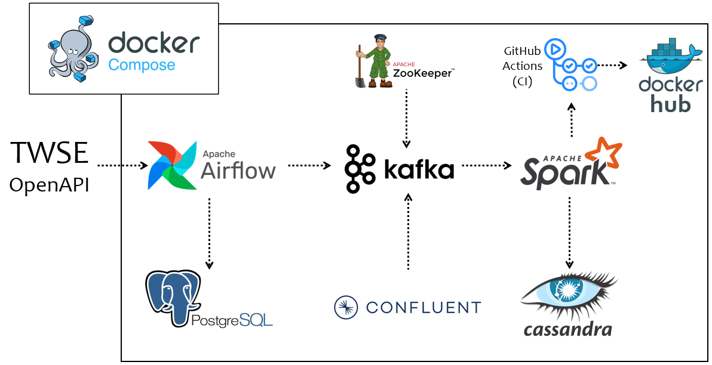

# Data Streaming Project: TWSE Stock

### Architecture

### Description

Use Airflow, Kafka, Spark, and Cassandra to establish a data pipeline.

It will fetch daily trading information of Taiwan stocks from [TWSE API](https://openapi.twse.com.tw/) every day.

### Screenshot

1. Airflow: do fetch task.

2. Kafka: we can see the stock information.

3. Cassandra: finally we store data here.

